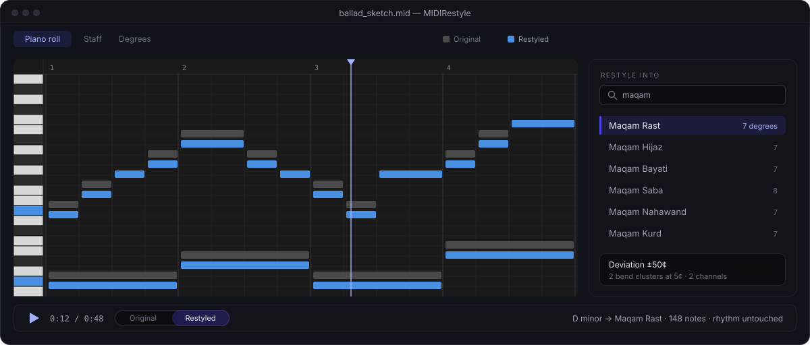

<div align="center">


# MIDIRestyle

### Your melody, in someone else's tuning.

Drop in a MIDI file, choose a target musical style, and MIDIRestyle converts it. A melody written in
Ionian can come back as Chinese pentatonic, Javanese pelog, Arabic maqam, or any of the **171 scales**
that ship with it. Rhythm and phrasing stay exactly as you played them — only pitch is re-mapped.

[](https://github.com/aaronbrataaditama/MIDIRestyle/releases/latest)
[](https://github.com/aaronbrataaditama/MIDIRestyle/releases)


[](LICENSE)



**[midirestyle.netlify.app](https://midirestyle.netlify.app/)** &nbsp;·&nbsp;
[Download for Windows](https://github.com/aaronbrataaditama/MIDIRestyle/releases/latest) &nbsp;·&nbsp;
[Release notes](https://github.com/aaronbrataaditama/MIDIRestyle/releases)

</div>

## Or just ask — MIDIRestyle speaks MCP

The same `.exe` doubles as a [Model Context Protocol](https://modelcontextprotocol.io) server. Point
Claude — or any MCP client — at it, and your agent can search the scale library, read your MIDI,
restyle it and export the result. Nothing extra to install, and your files never leave your machine.

Three lines in `claude_desktop_config.json`:

```json
{ "mcpServers": {
  "midirestyle": { "command": "C:\\Tools\\MIDIRestyle.exe", "args": ["--mcp"] }
} }
```

Or one line in Claude Code:

```
claude mcp add midirestyle -- "C:\Tools\MIDIRestyle.exe" --mcp
```

> *Help ▸ Agent access (MCP)…* inside the app shows both snippets with **this** exe's real path
> already filled in — worth using, because a portable exe can live anywhere and be renamed.

An agent host spawns the server; you never run `--mcp` by hand. It speaks over stdin/stdout only —
no window, no network, no second copy of the app installed.

> **You** — take `ballad_sketch.mid` and try it in a few Middle Eastern styles. Keep whichever one
> holds the melody's shape best.

```text
inspect_midi   ballad_sketch.mid          →  148 notes · D minor · 72 bpm · 4 tracks
list_scales    query: "maqam"             →  16 scales
describe_scale middleeast.arabic.maqam-rast  →  7 degrees · ±50¢ from 12-TET · 2 bend clusters
restyle_midi   → Maqam Rast               →  ballad_sketch.middleeast.arabic.maqam-rast.mid
restyle_midi   → Maqam Hijaz              →  ballad_sketch.middleeast.arabic.maqam-hijaz-notated.mid
```

> **Agent** — Hijaz is the one: its lowered 2nd lands right on your hook, and the descending motif in
> bars 5–8 survives intact. Rast smoothed it out too much. Written with per-channel pitch bend, so
> the tuning holds up in your DAW.

### The tools it exposes

| Tool | What it does |
| --- | --- |
| `inspect_midi` | Tracks, notes, tempo, time signature and the detected key of a file on disk, as structured data. |
| `list_scales` | Browse and filter all 171 scales — by tradition, degree count, whether they notate, how far they sit from 12-TET. |
| `describe_scale` | One scale in detail: degrees in cents, its spelling, its deviation, and what it will cost in MIDI channels. |
| `restyle_midi` | Runs the desktop app's own pipeline and writes the restyled `.mid`, pitch bend included. |
| `export_musicxml` | Writes notation, for scales that can honestly be spelled on a staff. |

Plus a `choose_a_style` prompt that walks a user to a scale one question at a time.

Every path passed to the tools must be absolute. Outputs default to `<input>.<scale-id>.mid` beside
the input, and an existing file is never overwritten unless `overwrite` is true.

## How it works

Three steps, no theory homework.

**01 · Drop in a MIDI file** — anything you already have: a sketch, a stem, a full arrangement.
MIDIRestyle reads the tracks, detects the key, and shows you what it found.

**02 · Choose the target style** — search the library by name or tradition: maqam, melakarta,
gamelan, wǔshēng, koto tunings, the church modes. Arrow-key down the list and the transform re-runs
per keystroke.

**03 · Hear it converted** — play it back in the app, switch between original and restyled on the
fly, then keep it, tweak it, or try another.

## What's in it

More than a converter — somewhere to look at the result.

- **Piano roll and staff view** — see the file as a piano roll with a keyboard and bar ruler, or as
  wrapped systems of real engraved notation with a playhead that follows playback. Click the staff
  to seek.
- **Scale wheel** — the degree view lays the scale out as a wheel, with degrees at their *true cents
  angle* against the twelve equal-tempered ticks. That gap is the whole point: Maqam Rast's neutral
  third sits visibly between a major and a minor one. Its furniture stays put while playback
  recolours it, so you can watch which degrees the music actually leans on.
- **A/B the original** — switch between the source and the restyled version mid-playback, without
  leaving for a DAW.
- **Microtonal-accurate export** — scales that don't sit on 12-TET (maqam, dastgāh, slendro, pelog,
  Thai 7-equal) are exported with per-channel pitch bend, one channel per distinct cent-offset rather
  than per voice, so the tuning survives the round trip. Preview and exported file come out of the
  same code path and can't disagree.
- **MIDI and MusicXML out** — save the result as a MIDI file, or export MusicXML to carry the
  notation into Sibelius, MuseScore or Dorico.
- **Portable and private** — one self-contained `.exe`. No installer, no account, no upload. Copy it
  to a USB stick and run it.

Restyling is **pitch remapping only** — it never touches rhythm, ornamentation or articulation.

## The scale library

171 scales ship with the app, grouped by tradition:

| Tradition | Scales | A few of them |
| --- | --: | --- |
| South Asia | 82 | The ten thaats, plus all 72 Carnatic melakarta — generated from the Ri/Ga, Dha/Ni and Ma positions rather than hand-typed |
| Middle East | 16 | Maqam Rast, Bayati, Hijaz, Saba — in quarter-tone notated *and* just-intonation tunings |
| Türkiye | 15 | Makam Rast, Uşşak, Hüseyni, Buselik (AEU) |
| East Asia | 13 | Gong, Shang, Jiao, Zhi, Yu (wǔshēng); Japanese in, yō, hirajōshi, iwato, kumoi; Korean p'yŏngjo, kyemyŏnjo |
| Europe | 12 | The seven church modes, harmonic and melodic minor, double harmonic, Hungarian minor, Ukrainian Dorian |
| Southeast Asia | 11 | Slendro and pelog as measured from *named* gamelan, plus Thai 7-tone, idealised and measured |
| Persia | 10 | Dastgāh-e Shur, Homāyun, Māhur and others, on Farhat's intervals |
| Africa | 9 | Ethiopian kiñit (tizita, bati, ambassel, anchihoye), equiheptatonic, equipentatonic, bow-music overtones |
| Americas | 3 | Blues hexatonic, minor and major pentatonic |

Every hand-authored scale carries a source citation, and a test fails the build if one is missing —
wrong cents values make a wrong app, and that is not the kind of error a mechanical test would ever
catch. You can also author your own in the scale editor, or bring in Scala `.scl` files.

## Getting it

Download `MIDIRestyle.exe` from [the latest release](https://github.com/aaronbrataaditama/MIDIRestyle/releases/latest)
— a single self-contained file, 51.2 MB, Windows x64, no installer. Copy it anywhere (including a
USB stick) and run it.

Settings and the writable scale library live in a `scales/` folder written beside the exe on first
run, falling back to `%APPDATA%` when that location isn't writable (a read-only stick, Program
Files). Setting `MIDIRESTYLE_DATA_ROOT` to an absolute path overrides both.

## Building from source

Requires the .NET 10 SDK (pinned in `global.json`).

```powershell
dotnet build                                    # whole solution
dotnet test                                     # all tests - do NOT add --nologo, see below
dotnet run --project src/MidiRestyle.App        # launch the app
```

A single test or class:

```powershell
dotnet test --filter "FullyQualifiedName~ChannelAllocatorTests"
dotnet test --filter "FullyQualifiedName~ChannelAllocatorTests.RastAllocatesTwoChannels"
```

**Never pass `--nologo` to `dotnet test`.** The .NET 10 SDK forwards unrecognised arguments to the
underlying test application, which rejects the flag and reports "Zero tests ran" even when every
test passed. If `dotnet test` ever reports zero, read the per-assembly `Standard output:` block —
that's where the real error is.

### The portable release

```powershell
dotnet publish src/MidiRestyle.App -c Release -r win-x64 --self-contained true `
  -p:PublishSingleFile=true `
  -p:IncludeNativeLibrariesForSelfExtract=true `
  -p:EnableCompressionInSingleFile=true
```

The publish folder must end up holding **exactly one file** — that's the whole portability promise.
This is enforced automatically: a gate built into `MidiRestyle.App.csproj` runs after every publish
and fails the build loudly if a second file shows up (a stray native library, a debug symbol,
anything). It caught a real bug during development — see the csproj comments for the mechanism, and
`CLAUDE.md` for the full history.

## Project status

v1 is complete, with five releases on top of it. All twelve build phases are done — the domain
model, the 171-scale library, key detection, the restyle engine, channel allocation for microtonal
export, audio playback with an A/B switch, and the portable single-file publish — as are the three
features v1 deferred: MusicXML export, the staff view and the degree view.

Since then: **v1.2** rebuilt the notation as a wrapped page of systems with a following playhead and
turned the degree view into a scale wheel; **v1.3** added click-to-seek on the staff and real clef
and rest glyph outlines; **v1.4** added the About window and bundled the third-party licence notices;
**v1.5** put bar counts in the file pane, a keyboard and a bar ruler on the piano roll, and rebuilt
the degree wheel so its furniture stays put and playback only recolours it; and **v1.6** added the
embedded MCP server, so the same exe can be driven by an agent.

Last verified green at v1.6.0: **1572 tests, 0 warnings**, and a portable publish of exactly one
51.2 MB file.

## Where the real documentation lives

This README is the shop window. For anything deeper:

- [`.claude/plan/PLAN-midi-restyle.md`](.claude/plan/PLAN-midi-restyle.md) — the authoritative spec
- [`.claude/STRUCTURE.md`](.claude/STRUCTURE.md) — map of the repository layout
- [`.claude/PROGRESS.md`](.claude/PROGRESS.md) — phase-by-phase implementation state and handover
  notes
- [`CLAUDE.md`](CLAUDE.md) — architecture and the load-bearing invariants behind the design

## Licence

MIDIRestyle is released under the [MIT License](LICENSE).

The shipped `.exe` is self-contained, so it also redistributes its dependencies and the .NET
runtime. Their licences and copyright notices are reproduced in full in
[THIRD-PARTY-NOTICES.txt](THIRD-PARTY-NOTICES.txt) — MIT for most of them, BSD for ANGLE and Skia,
and the SIL Open Font License for the Inter typeface, which requires that its licence be
distributed along with the font.

That last requirement is why the notices are embedded in the executable as well as published here.
A single-file build leaves no room for a companion file beside the `.exe`, so the text travels
inside it and can be read from **About → third-party notices**; a copied `.exe` carries its notices
with it.
